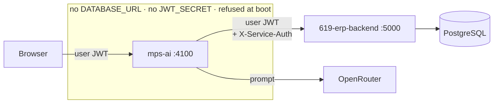
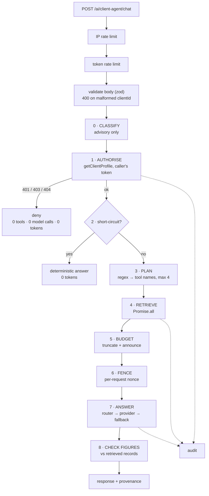
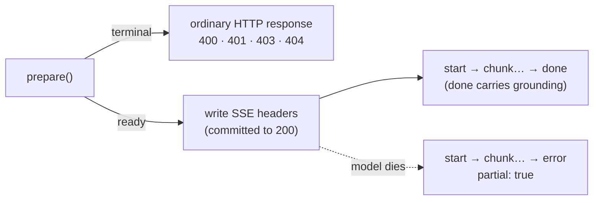
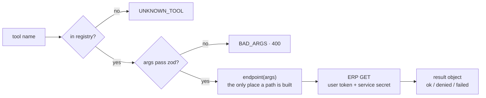
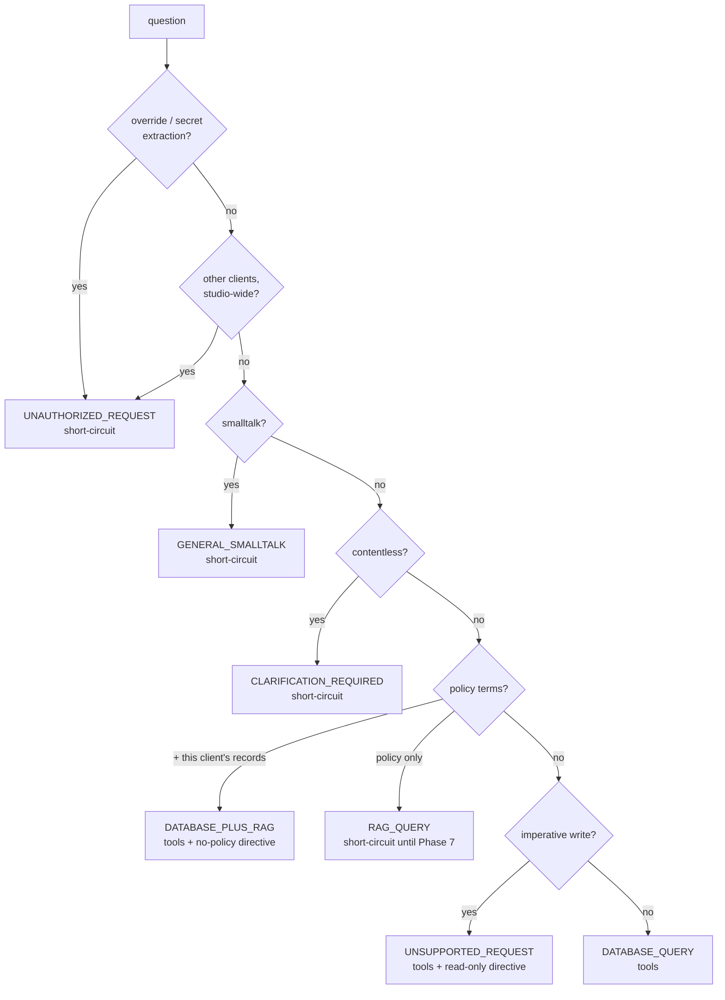
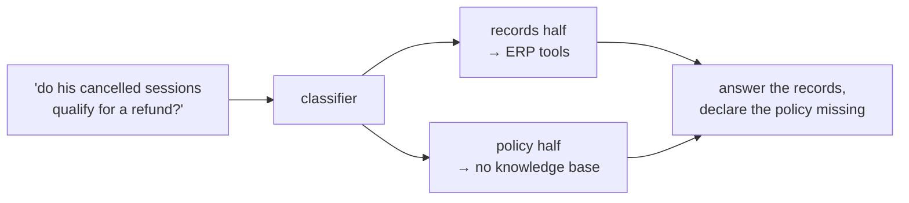
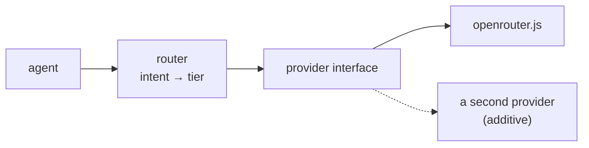

# Architecture

How MY PT STUDIO AI is put together, and why each seam is where it is.

For the security argument specifically, see [SECURITY.md](./SECURITY.md).
For the audit that produced this design, see [PHASE-0-DISCOVERY.md](./PHASE-0-DISCOVERY.md).

---

## 1. The one-sentence version

This service turns a question into a **bounded set of authorised reads**, fences
what comes back as untrusted data, and asks a model to explain it — holding no
database connection and no ability to sign a token.

```
FRONTEND = INTERFACE     AI PLATFORM = INTELLIGENCE
ERP BACKEND = AUTHORITY  DATABASE = SOURCE OF TRUTH
```

## 2. Where this service sits



The ERP's JWT payload is `{ id, token_version }` and nothing more — role,
organisation and tenant are loaded from Postgres by the ERP on every request. So
this service **cannot make an authorisation decision even if it wanted to**.
There is nothing in the token to read. It forwards the token and lets the ERP
decide, which is not a shortcut but the only design in which the ERP stays the
authority.

## 3. Request lifecycle



**Step order is the security design, not a style choice.** Authorisation is step
one for every turn — including smalltalk, including short-circuited turns. A
client the caller may not see costs one ERP read and ends there: no tools, no
prompt, no tokens, nothing about that client anywhere in the request.

Steps 0–6 live in `prepare()`, shared by both the buffered and the streaming
route. That is deliberate: the ordering *is* the security design, and a second
implementation of it is the one that would eventually be missing a step.

It also gives the SSE route the property it needs. Everything that can fail with
a status code has finished by the time `prepare()` resolves, so the stream opens
only when nothing is left that would rather have been an HTTP status:



Once SSE headers are written the response is committed to `200`. A `404`
decided after that point is no longer a `404` — it is a success carrying a sad
message, and a frontend switching on status never sees it.

## 4. Modules

| Module | Responsibility | Knows about |
|---|---|---|
| `api/clientAgent.js` | HTTP contract, body validation, bearer extraction, SSE framing | express, zod |
| `agents/client/agent.js` | orchestration; the step order above | planner, prompt, registry, fencing |
| `agents/client/planner.js` | question → tool names, and → model tier | nothing |
| `agents/client/prompt.js` | the system prompt, as data in one file | nothing |
| `platform/intent/classifier.js` | question → one of seven classes | nothing |
| `platform/tools/registry.js` | the closed tool enumeration | zod, the ERP client |
| `platform/context/untrusted.js` | fencing, neutralising, budget application | limits |
| `platform/limits.js` | truncation and context budget | nothing |
| `platform/time/studioClock.js` | civil dates in the studio's timezone | `Intl` |
| `platform/audit/log.js` | the audit trail | crypto, logger |
| `platform/grounding/check.js` | answer figures vs retrieved records | nothing |
| `platform/router.js` | intent → model tier; fallback, and why streaming's differs | provider |
| `platform/provider/openrouter.js` | the only place HTTP-to-a-model lives, buffered and streamed | fetch |
| `integrations/erp/client.js` | the only route out to studio data | fetch |

Two routers, deliberately distinct: `platform/intent/classifier.js` decides what
a question is *for*; `platform/router.js` decides which *model tier* answers it.

## 5. Why deterministic, twice

Both tool selection and intent classification are regex over the question, not a
model call. The reasons, in order of weight:

1. **Cost.** "When does their package expire?" should cost one ERP read and one
   model call. Asking a model which tools to use first doubles the model calls on
   every question to decide something a regex decides.
2. **Data minimisation.** Fetching everything and letting the model sort it out
   sends a client's medical notes to a provider to answer a question about a
   renewal date. The cheapest way not to leak a field is not to retrieve it.
3. **Testability.** A pure function from text to tool names can be asserted
   exactly. A model's tool choice can only be sampled.

The cost is paid honestly: an unanticipated phrasing falls to the broad default
(retrieve and ground) rather than to a refusal. That direction is chosen on
purpose — over-refusal costs usefulness, and the alternative default would cost
correctness.

## 6. The tool layer

A tool is a named function over **one known ERP endpoint**. There is no
`executeSQL`, no `runCommand`, no generic fetch. `run()` will not execute
anything it cannot find by name in the registry map.



Each tool declares `name`, `summary`, `args` (zod), `endpoint(args)` and `label`.
Failures return a **result object** rather than throwing, so a 403 stays
reportable as an authorisation *answer* instead of collapsing into a generic
outage the model would then guess about.

Deliberately absent from every tool: any notion of which organisation may run
it. That decision belongs to the ERP, which makes it from the forwarded token on
every call. Duplicating it here would create a second authorisation model to keep
in step with the first — and the copy that drifts is always the one nobody is
looking at.

### Current tools

All read-only, all single-client, each verified to exist in `619-erp-backend`.

| Tool | ERP endpoint |
|---|---|
| `getClientSummary` | `GET /api/pt-os/clients/:id/snapshot` |
| `getClientProfile` | `GET /api/pt-os/clients/:id` |
| `getClientTrainingBrief` | `GET /api/pt-os/clients/:id/training-brief` |
| `getClientSubscriptions` | `GET /api/pt-os/clients/:id/subscriptions` |
| `getClientRenewals` | `GET /api/pt-os/clients/:id/renewals` |
| `getClientCommunication` | `GET /api/pt-os/clients/:id/communication` |
| `getClientAttendance` | `GET /api/clients/:id/attendance` |
| `getClientPayments` | `GET /api/clients/:id/payments` |
| `getClientTrainingAnalytics` | `GET /api/pt-os/workout-log/analytics` |
| `getClientVolumeSummary` | `GET /api/pt-os/workout-log/volume-summary` |
| `getClientAssessmentHistory` | `GET /api/progress/assessments` |

## 7. Intent classification



Two things worth stating plainly:

**Short-circuits are statements about capability, never entitlement.** "This
assistant covers one client at a time" is a fact about the tool surface. "You may
not see that client" is an authorisation ruling, and this service is in no
position to make one — it cannot even read the caller's role.

**Write requests are not short-circuited.** "Create a workout for this client" is
a request for content the trainer will type into the app by hand. Refusing it
outright is less useful than producing the plan and saying where it goes, so it
gets a directive instead.

## 8. Database vs RAG (§13)

Two knowledge layers, kept apart on purpose:

| | Source | Answers |
|---|---|---|
| **Records** | PostgreSQL, via ERP endpoints | what *is the case* — sessions, payments, attendance, measurements |
| **Policy** | knowledge base (**not built**) | what the rules *say* — SOPs, refund policy, handbooks |



No knowledge base exists yet, and `knowledgeBase` is `null` rather than a stub.
A policy question therefore gets *"I don't have your studio's policy documents"*
— not a plausible cancellation policy improvised by a model and attributed to
the studio, which is the exact failure the grounding rules exist to prevent.

## 9. Grounding

Three cases the agent must not conflate, stated in the system prompt and
asserted in `grounding.test.js`:

1. **The data answers it** — give the figure and its date.
2. **Retrieved, but empty** — "no matching records were found". An empty list is
   not a zero to reason from.
3. **Not retrievable at all** — "I don't have that information in the available
   studio data." Never answered from general knowledge.

Conversation history is supplied by the caller, so it is **not evidence**. Every
factual claim is re-grounded on this turn's retrieved data; a user asserting "my
studio has 500 clients" is a claim, never a source.

## 10. Time

The model is told the studio's current date, weekday and timezone on every
request. Without it, "expiring soon" is answered against the model's training
cutoff and stated in the confident register of a database lookup.

Ranges are **civil dates** (`2026-08-01`..`2026-08-31`), not UTC instants:

- It is what a business question means — August is the 1st to the 31st on the
  wall calendar, not a 744-hour window measured from an offset.
- It is what the ERP will filter on.
- It sidesteps DST entirely, because the arithmetic never converts a civil date
  back into an instant.

Weeks start Monday. An unrecognised range resolves to `null` rather than a
guess, because inventing a default window is how "revenue" silently becomes
"revenue this month".

## 11. Budgets

`max_tokens` caps the *completion*; `MAX_TOOL_RESULT_CHARS` and
`MAX_CONTEXT_CHARS` cap the *input*, so a client with four years of attendance
cannot set the request size.

Anything cut is **announced inside its own fence**, because the announcement
matters more than the cut: a truncated list the model believes is complete
produces a confident, precise, wrong total. Results are budgeted in priority
order and anything dropped entirely is named.

## 12. Model abstraction



Only `provider/openrouter.js` knows about HTTP and a vendor's response shape.
The router adds one fallback attempt — a free-tier model that has failed twice
will not succeed on a third try inside one user's request, and runaway retry
cost is its own failure mode.

No security logic is coupled to a provider. Tenancy is enforced before a prompt
exists.

## 13. What is not built

Honest list; none of it is stubbed to look finished.

- **Studio-wide tools** — **deliberately not built here.** The ERP already has
  them, tenant-scoped and role-gated. Building a second set would create two
  places a tenant predicate can be edited. See [DECISIONS.md](./DECISIONS.md) D1.
- **Role-aware tool gating** — **satisfied by design.** This service cannot read
  a role; the ERP resolves one per request and returns 403, which the tool layer
  relays as a denial. A second role model here is explicitly rejected (D1).
- **RAG / knowledge base.** The ERP has one — documents, chunking, embeddings and
  a tenant-scoped `retrieveContext()`. It is reachable only from inside
  `routes/ai.js`, so this needs **one new ERP endpoint**
  (`GET /api/ai/knowledge/search`), not a new subsystem. The `ragAvailable`
  branch here is already written and tested. See
  [ERP-INTEGRATION-FACTS.md](./ERP-INTEGRATION-FACTS.md) §5.
- **Trainer-level object authorisation on client-by-id reads.** Not present in
  the ERP for these endpoints; see SECURITY.md §7.
- **Write actions**, **feedback and evaluation harness**,
  **frontend integration**, **assessment history**.

## 14. Adding an agent

`agents/<name>/` with a planner, a prompt and an orchestrator. The provider,
model router, intent classifier, tool registry, fencing, budgets, clock, audit,
config and HTTP surface are shared and need no changes — which was the point of
building the platform seams before building ten half-finished agents.
