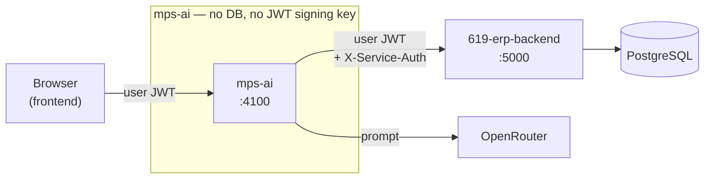
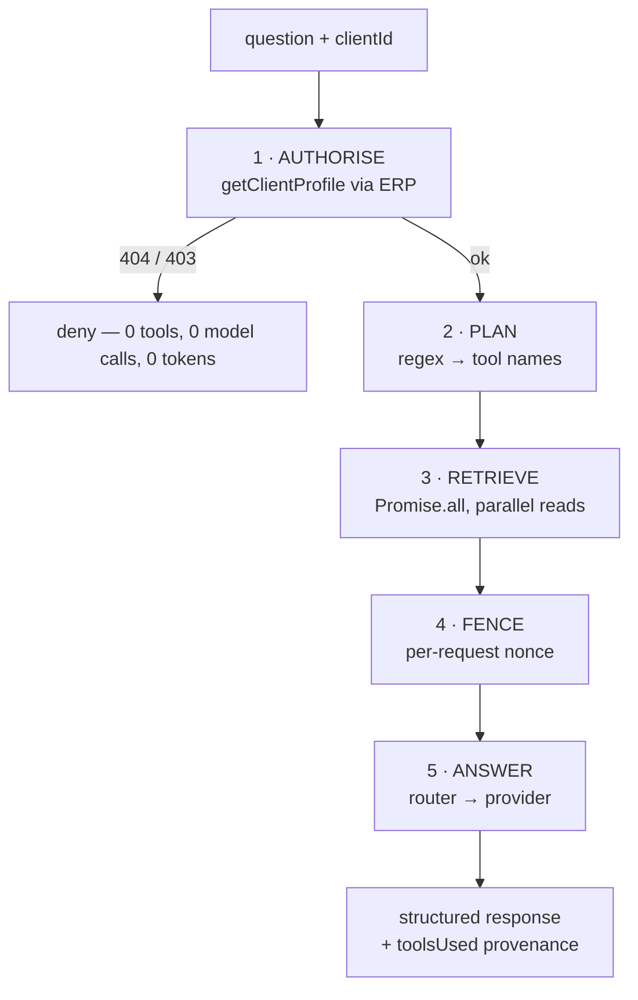
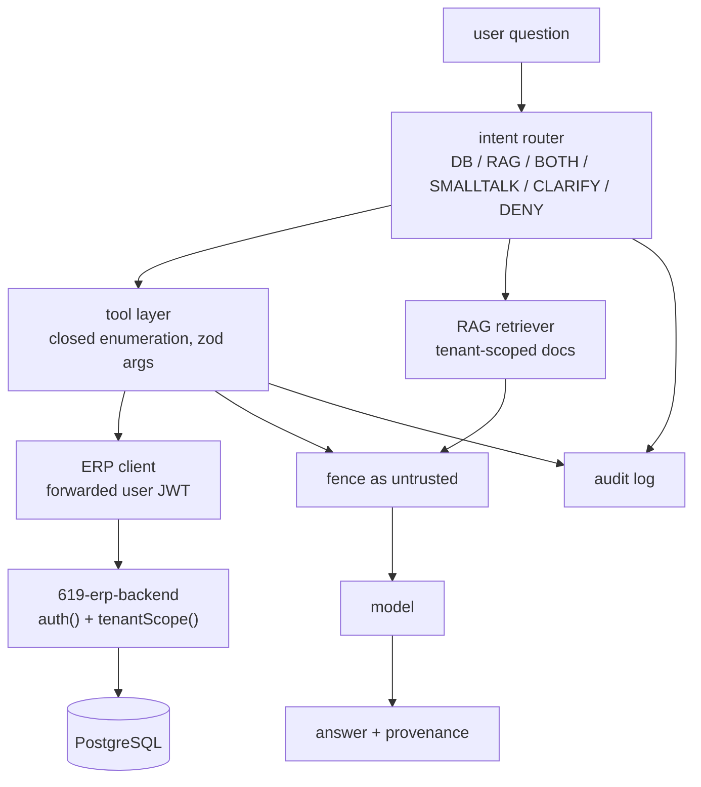

# Phase 0 — Repository Discovery & Gap Analysis

**Repository:** `abhishek21lift-oss/mps-ai` @ `178e183`
**Baseline verified before any change:** `npm test` → 19/19 pass · `npm run lint` → clean
**Status:** analysis only. No source file modified.

---

## 0. The headline finding, before anything else

The master brief asks for a **database-grounded agent** built by discovering, *inside this
repository*, the Postgres schema, migrations, ORM models, tenant columns, auth middleware,
RLS policies, roles and indexes of MY PT STUDIO.

**None of that is in this repository, and its absence is deliberate and load-bearing.**

`mps-ai` is not the MY PT STUDIO application. It is a separate, independently deployable
*intelligence layer* that holds **no database connection at all**. There is no
`DATABASE_URL`, no `pg` dependency, no ORM, no migration, and no SQL string anywhere in the
tree. `src/config.js` **refuses to boot** if `DATABASE_URL`, `JWT_SECRET` or
`SUPABASE_SERVICE_ROLE_KEY` is present, and two tests assert that refusal.

The database, the tenant columns, the roles and the authorisation logic all live in a
**different repository — `619-erp-backend`** — which this service reaches over HTTP.

This means the brief's central instruction ("inspect the schema, then build tools over it")
cannot be carried out against this repo as written, and several of its requirements are
already satisfied by a *different mechanism* than the one it prescribes. §12 of this
document sets out the fork that follows.

Two discovery channels that would have closed the gap were unavailable in this session:
`619-erp-backend` could not be attached (`add_repo` — approval required) and the Supabase
MCP could not be queried (`list_projects` — approval required). Everything below is
therefore derived from this repository's source, which references the ERP's internals
precisely enough (file paths and line numbers in comments) to be trustworthy about the
boundary, but not enough to enumerate tables.

---

## 1. Current architecture



Single Node 20 / Express 4 service, CommonJS, ~1,100 lines of source. Stateless: conversation
history is supplied by the caller each turn, nothing is persisted, so it scales horizontally
with no coordination.

| Layer | File | Role |
|---|---|---|
| Entry | `src/server.js` | boot, listen, SIGTERM drain |
| Assembly | `src/app.js` | helmet · CORS allow-list · rate limit · routes · error handler |
| Config | `src/config.js` | zod-validated env, **forbidden-secret assertion** |
| HTTP API | `src/api/clientAgent.js` | `POST /ai/client-agent/chat` |
| Agent | `src/agents/client/{agent,planner,prompt}.js` | orchestration, tool selection, system prompt |
| Platform | `src/platform/router.js` | intent→model tier, single fallback |
| Platform | `src/platform/provider/openrouter.js` | the only provider implementation |
| Platform | `src/platform/tools/registry.js` | closed tool enumeration |
| Platform | `src/platform/context/untrusted.js` | prompt-injection fencing |
| Egress | `src/integrations/erp/client.js` | the **only** route to studio data |
| Logging | `src/lib/logger.js` | pino + redaction list |

Dependencies are deliberately few: `express`, `cors`, `helmet`, `express-rate-limit`, `pino`,
`zod`. Dev: `jest`, `supertest`, `eslint`. **No AI SDK, no agent framework, no ORM, no vector
DB, no MCP package.** The OpenRouter call is hand-rolled `fetch`.

## 2. Existing agent architecture

One agent — the **Client Agent** — scoped to answering a trainer's questions about **one
authorised client**.



Design decisions worth preserving, each of which the master brief independently asks for:

- **Authorise first.** The client is resolved through the ERP *before* any other tool runs
  and before any prompt is built. A denied client costs one ERP read and zero tokens
  (`agent.js:89`). This is the brief's §5 flow, already built.
- **Deterministic planning.** Tool selection is regex pattern matching (`planner.js`), not a
  model call. One round trip instead of two, exactly-testable, and it is *data minimisation*:
  "when does their package expire?" does not ship the client's medical notes to a model
  provider.
- **Profile reuse.** The authorisation read is reused as a tool result rather than re-fetched
  (`agent.js:107`).
- **Provenance returned to the UI.** `toolsUsed` / `toolsUnavailable` are in the response
  shape, so a trainer can see what an answer rests on — the brief's §21.
- **Write contract stubbed from day one.** `proposedAction` / `requiresConfirmation` always
  `null`/`false`, so adding a write later is additive rather than a redesign (§9).

## 3. Database architecture

**In this repository: none, by construction.** Restated because it is the pivot of the whole
analysis:

| Brief expects | Reality in `mps-ai` |
|---|---|
| Postgres client / ORM | absent — no `pg`, no Prisma, no Knex |
| Migrations | absent |
| Schema / models | absent |
| SQL | absent — zero SQL strings in the tree |
| `DATABASE_URL` | **refused at boot** (`config.js:65`) |

Every fact the agent can state arrives as JSON from an ERP endpoint that has already applied
`tenantScope()`. The brief's §7 ("do not give the LLM raw database access") and §9
("read-only") are therefore not policies to enforce here — there is no connection to run a
query on, and no non-GET method in the egress client (`erp/client.js` exposes `get` only).

**What can be inferred about the real schema** from code comments, tool endpoints and the
fencing rationale — treat as leads to verify against `619-erp-backend`, not as fact:

- Tenant column is **`organization_id`**, enforced by an ERP helper named **`orgWhere()`**
  (`erp/client.js:39`, cited to `pt-os.routes.js:1629-1635`), with a broader **`tenantScope()`**
  referenced in the README.
- Tables/entities implied: `pt_clients` (with `.notes`, `.injuries`), goals, assessments,
  `weekly_checkins` (`.client_notes`), subscriptions, renewals, attendance, payments,
  communication history, programmes, PAR-Q, posture/mobility findings, personal records.
- JWT payload is **`{ id, token_version }`** only (cited to `routes/auth.js:229`); role and
  organisation are loaded from Postgres per-request by `auth()` (`middleware/auth.js`).
- ERP response envelope is `{ data: {...} }` on `pt-os` routes, bare elsewhere — the agent
  tolerates both (`agent.js:47`).

## 4. Authentication architecture

The service **cannot authenticate anyone, and that is the design.**

- The browser's `Authorization: Bearer <ERP JWT>` is taken verbatim (`api/clientAgent.js:23`)
  and forwarded verbatim (`erp/client.js:88`). It is never decoded, never verified, never
  cached.
- It *cannot* usefully be decoded: the payload carries no authorisation claims, only
  `{ id, token_version }`.
- Missing token → `401` before any work (`api/clientAgent.js:38`), and the ERP client refuses
  to make an unauthenticated call at all (`erp/client.js:74`).
- Because no identity is cached, **`token_version` revocation keeps working** — log a user
  out everywhere and the forwarded token dies at the ERP on the next call.

Second credential: `X-Service-Auth` (≥32 chars) proves *this service* is calling, not the open
internet. It identifies no user. **See §11.1 — the ERP does not yet verify it.**

## 5. Multi-tenancy architecture

Tenant isolation is **inherited, not re-implemented** — and that is a deliberate refusal to
build a second authorisation model.

The enforcement chain:

1. **No tool accepts an organisation id.** Every registered tool's zod schema is
   `{ clientId }` and nothing else (`registry.js:44-106`). The model has no parameter through
   which to name another tenant — the brief's §5/§16 requirement, enforced by the *shape of
   the schema* rather than by a runtime check.
2. **`clientId` is untrusted.** It arrives from the browser, is validated as an opaque token
   (`^[A-Za-z0-9_-]{1,64}$`, `registry.js:27`) which blocks path traversal, and is used
   **only** as a path parameter.
3. **The ERP decides.** `orgWhere()` returns **404** for a client in another organisation.
   The agent treats that 404 as a hard gate on step one.

The service holds no opinion about tenancy, by design: *"a second opinion about tenancy is a
second thing to get out of step with the first"* (`erp/client.js:41`).

**Known, documented boundary — inherited on purpose.** Client authorisation in MY PT STUDIO is
**organisation-level, not trainer-level**. `GET /pt-os/clients/:id` filters on
`organization_id` only; no trainer-level restriction exists in the ERP. A trainer can already
open a colleague's client in the normal UI. This service deliberately inherits exactly that
boundary so the assistant never disagrees with the screen beside it.

> This directly collides with the brief's **§19 (secondary object-level authorisation)**,
> which requires that a trainer asking "show me all clients" be restricted to *assigned*
> clients. That control **does not exist in the ERP today**. Building it in `mps-ai` would be
> the stricter-copy-that-drifts anti-pattern the architecture exists to avoid. It belongs in
> the ERP. See §11.7.

## 6. Existing security controls

| Control | Where | Assessment |
|---|---|---|
| Forbidden-secret boot assertion | `config.js:67` | **Strong.** Structural, not policy. |
| Fail-fast config validation | `config.js:78` | Strong — zod, whole env, at boot. |
| CORS exact allow-list, `credentials:false` | `app.js:29` | Strong. `*` refused; empty refused in prod. |
| Rate limiting, token-keyed | `app.js:56` | Adequate. See §11.2. |
| helmet, `x-powered-by` off, 128 kb body cap | `app.js:21-24` | Standard, correct. |
| Closed tool enumeration | `registry.js` | **Strong.** No SQL/shell/generic-fetch tool exists. |
| Per-tool zod arg validation | `registry.js:135` | Strong — traversal blocked before URL build. |
| Authorise-before-anything | `agent.js:89` | **Strong.** Gate, not one read among many. |
| Prompt-injection fencing | `context/untrusted.js` | **Strong.** Nonce fence + neutralise + restate. |
| GET-only egress | `erp/client.js` | Strong — no write method exists to call. |
| Log redaction | `lib/logger.js:13` | Good. Covers auth headers, keys, tokens. |
| Generic user-facing errors | `api/clientAgent.js:80` | Good — no stack traces, no upstream URLs. |
| Denial statuses passed through | `erp/client.js:114` | Good — 403 reads as denial, not outage. |

The prompt-injection design deserves specific credit against brief §26/§27: it is
**structural, not a blocklist** — a per-request nonce fence (unguessable by a note written
last week), neutralisation of fence spellings and chat role markers, and a *restatement after*
the data because models weight later tokens more heavily. The reasoning is written down and
correct.

## 7. Existing RAG architecture

**None.** No vector store, no embeddings, no chunking, no document ingestion, no retrieval
beyond the eight ERP endpoints. Nothing in `package.json` supports it.

The brief's §13 two-layer split (Postgres for dynamic business data, RAG for SOPs/policies)
is **entirely unbuilt** — the single largest missing subsystem.

## 8. Existing tool architecture

A `Map` registry with a `define()` guard against duplicate names. Each tool declares `name`,
`summary`, `args` (zod), `endpoint(args)` and `label`. `run()` resolves by name — an
unregistered name is refused at the enforcement point, not assumed away.

Eight read-only tools, all `getClient*`, each mapping to exactly one verified ERP endpoint:

| Tool | ERP endpoint |
|---|---|
| `getClientSummary` | `GET /api/pt-os/clients/:id/snapshot` |
| `getClientProfile` | `GET /api/pt-os/clients/:id` |
| `getClientTrainingBrief` | `GET /api/pt-os/clients/:id/training-brief` |
| `getClientSubscriptions` | `GET /api/pt-os/clients/:id/subscriptions` |
| `getClientRenewals` | `GET /api/pt-os/clients/:id/renewals` |
| `getClientCommunication` | `GET /api/pt-os/clients/:id/communication` |
| `getClientAttendance` | `GET /api/clients/:id/attendance` |
| `getClientPayments` | `GET /api/clients/:id/payments` |

`run()` returns a **result object** on failure rather than throwing, so a 403/404 stays
reportable as an authorisation *answer* instead of collapsing into a generic outage.

**Against the brief's §8 tool wish-list:** every studio-wide tool
(`get_studio_summary`, `get_revenue`, `get_dashboard_metrics`, `get_expiring_memberships`,
`get_trainer_performance`, `get_inventory`, `get_leads`, `get_staff`, …) is **missing**. The
current agent is *per-client only*. It cannot answer "how many active PT clients do I have?",
which is the brief's own first worked example.

## 9. What can be reused

**KEEP unchanged** — these are the strongest abstractions here and the brief asks for all of them:

| Subsystem | Why |
|---|---|
| `config.js` forbidden-secret assertion | The security property everything rests on. |
| `context/untrusted.js` fencing | Satisfies §26/§27 better than most implementations. |
| `platform/tools/registry.js` shape | The closed enumeration §7/§30 demands. Extend, don't replace. |
| `integrations/erp/client.js` | Token forwarding is the correct tenancy design. |
| `platform/provider/*` + `router.js` | Already model-agnostic (§35). Seam exists. |
| `app.js` HTTP hardening | CORS, helmet, rate limit, error handling all correct. |
| Authorise-first ordering in `agent.js` | The §5 flow, already correct. |
| Response envelope incl. `proposedAction` | §20/§21 provenance and the write contract. |
| Test style (real app + fake collaborators) | Assertions mean something. Extend this file. |

**MODIFY:** `planner.js` (per-client regexes only), `prompt.js` (no date, no RAG/DB separation),
`agent.js` (single-client orchestration; and the §11.3 bug), `registry.js` (needs studio-scope
tools), `api/clientAgent.js` (`clientId` is mandatory, so no studio-wide question can be asked).

**REPLACE:** nothing. **REMOVE:** nothing.

**MISSING** (must be built): studio-scope tools · intent router (§14) · RAG layer (§13) ·
audit logging (§28) · date/timezone handling (§22) · result-size limits (§24/§44) ·
role-aware tool gating (§18) · no-hallucination guardrails beyond prompt text (§5/§33).

## 10. What must change

Ordered by how much it matters.

1. **Scope.** One per-client agent → studio-wide question answering. This is the bulk of the
   work and it is *blocked on knowing which ERP endpoints exist* (§18 risk).
2. **The intent router** (§14): `DATABASE_QUERY` / `RAG_QUERY` / `DATABASE_PLUS_RAG` /
   `GENERAL_SMALLTALK` / `CLARIFICATION_REQUIRED` / `UNAUTHORIZED_REQUEST` /
   `UNSUPPORTED_REQUEST`. Note `platform/router.js` is a *model* router (intent→tier), not
   this; the name will need disambiguating.
3. **RAG layer** (§13), entirely new, including a tenant-scoped document store.
4. **Audit logging** (§28) — currently only operational logging exists.
5. **Date/time handling** (§22) — see §11.4, nothing exists.
6. **Result limits and pagination** (§24) — see §11.5, nothing exists.
7. **Fix the confirmed defects** in §11.

## 11. Security & correctness findings

Ordered by severity. Items 3 and 4 were confirmed by execution, not by reading alone.

### 11.1 — `X-Service-Auth` is not verified by the ERP · *Medium, pre-existing, known*
This service sends the header on every call; **the ERP does not yet check it** (README, "Not
built yet"). The intended second factor is currently decorative: the user JWT is doing all the
authorisation work. Tenancy is still sound (the JWT is the part that matters), but the
"requests must come from the AI service" property does not hold. **Fix belongs in the ERP.**

### 11.2 — Rate limiter can be evaded before authentication · *Low*
`app.js:61` keys on the last 32 chars of the `Authorization` header. The limiter runs *before*
the route's token check, so an unauthenticated attacker sending a fresh garbage token per
request gets a fresh bucket each time. Cost is bounded — those requests `401` at
`api/clientAgent.js:38` with no ERP or model call — but there is **no IP-based backstop** for
an unauthenticated flood. Recommend a second, IP-keyed limiter for requests with no valid
bearer shape.

### 11.3 — `neutralise()` corrupts every assistant history turn · *High (correctness + cost)* · **CONFIRMED**
`agent.js:67` calls `neutralise(content, '')` with an **empty** `fenceId`. Inside,
`new RegExp('', 'g')` matches the empty string at every position, so
`.replace(/(?:)/g, '[fence-removed]')` injects the marker between **every character**.

Verified by execution:

```
in : "Rahul weighs 78.4 kg."                                    (21 chars)
out: "[fence-removed]R[fence-removed]a[fence-removed]h…"       (351 chars)
```

Consequences: multi-turn conversation is **broken** — the model sees shredded text for every
prior assistant turn; and history costs **~16× the tokens** it should. The existing §51.11
test passes only because it asserts on the system prompt and on freshly retrieved data, never
on replayed history content. Fix: make the `fenceId` replacement conditional on a non-empty id.

### 11.4 — The model is never told the current date · *High (hallucination)* · **CONFIRMED**
Grep across `src/` for `timezone|toISOString|Date(|today|TZ` returns **one comment and no
code**. The system prompt contains no date, and no timezone is configured anywhere. Any
question containing "this month", "expiring soon", "how many days left" is therefore answered
by a model with **no idea what today is** — it will fall back to its training cutoff or
invent. This is a direct §22 gap and a live §3 no-hallucination violation. Fix: inject the
studio's current date/time into the system prompt, and resolve relative ranges server-side.

### 11.5 — No bound on retrieved data size · *Medium (cost + availability)*
`untrusted.js:76` does `JSON.stringify(data, null, 1)` on whatever the ERP returned, with no
truncation, row cap or token budget anywhere in the path. A client with a long attendance or
payment history produces an unbounded prompt. `maxTokens` caps only the *completion*.
Directly contrary to §24/§44. Fix: per-tool result caps with explicit "truncated" markers the
model is told about.

### 11.6 — Caller-supplied history can fabricate grounded-looking facts · *Medium*
`history` comes from the browser and is trusted as conversation (`api/clientAgent.js:17`).
A caller can inject an `assistant` turn asserting anything — "Rahul's outstanding balance is
₹0" — which the model may treat as its own prior grounded output and repeat. This is the §34
failure mode (memory becoming a source of truth) reachable directly from the client. Mitigate
by labelling replayed assistant turns as unverified prior text and re-grounding every factual
claim on this turn's retrieved data.

### 11.7 — No object-level authorisation · *Accepted architectural boundary, not a defect here*
The brief's §19 wants trainer-level client restriction. It **does not exist in the ERP**, so
it cannot be enforced here without inventing a second, stricter authorisation model that would
disagree with the app's own UI. Recorded as a deliberate inheritance. **Belongs in the ERP.**

### 11.8 — Expired token surfaces as `403` rather than `401` · *Low*
`registry.js:156` maps both 401 and 403 to "You are not authorised to see this", and
`agent.js:94` then defaults to status 403. A frontend cannot distinguish "log in again" from
"you may not see this client". Fix: preserve 401 distinctly.

### 11.9 — Argument-validation mismatch between layers · *Informational*
`api/clientAgent.js` accepts any string ≤64 for `clientId`; `registry.js` requires
`^[A-Za-z0-9_-]+$`. Defence holds (the registry rejects before any URL is built) but the
rejection surfaces as a confusing `BAD_ARGS`/403 rather than a clean 400.

**No critical vulnerability was found.** The tenancy design is sound, the tool surface is
genuinely closed, and injection defence is above average. The high-severity items are a
correctness bug and a grounding gap, not a data-leak path.

## 12. Recommended architecture — and the fork that must be decided first

Everything above converges on one decision that changes the entire implementation, and it is
**the user's call, not mine**:

### Option A — Keep the ERP as the authority *(recommended)*

`mps-ai` stays database-free. New capability is added by registering new tools over **new or
existing ERP endpoints**.



- Satisfies §2, §5, §6, §7, §9, §15, §16, §17 **as already built** — tenancy is enforced once,
  in the ERP, where the app's own UI enforces it.
- Cost: studio-wide questions need ERP endpoints that may not exist yet, so some work lands in
  `619-erp-backend`. Aggregation (§23) happens there, in SQL, which is where the brief wants it.
- §25 (index audit) and parts of §10 execute **against the ERP repo**, not this one.

### Option B — Give `mps-ai` its own Postgres connection

A literal reading of the brief (§2, §7, §15, §23, §25) implies direct database access with a
schema-aware validator and tenant-predicate injection.

**I recommend against it, and would want it in writing before implementing.** It requires
deleting the boot-time forbidden-secret assertion and the tests that cover it, and it creates
a **second authorisation model** that must be kept in step with the ERP's `orgWhere()` /
`tenantScope()` forever. The repository's own documentation argues, correctly, that the copy
which drifts is always the one nobody is looking at — and a drifted tenant predicate is a
cross-tenant data breach. It also breaks `token_version` revocation, because this service
would resolve identity itself rather than deferring per-request.

**Recommendation: Option A.** It reaches every acceptance criterion in §42 that is reachable
from this repository, without dismantling the property the service was built around.

## 13. Implementation plan (under Option A)

| Phase | Work | Depends on |
|---|---|---|
| **1** | Fix §11.3 (history corruption), §11.4 (date injection), §11.8 (401), §11.9 (400) + regression tests | nothing — **can start now** |
| **2** | Result-size caps and truncation markers (§11.5); IP-keyed limiter backstop (§11.2) | nothing — **can start now** |
| **3** | Audit-log module: intent, tool, args, outcome, latency, row count — no PII, no secrets (§28/§29) | nothing — **can start now** |
| **4** | Intent router (§14) with the seven classes; rename the model router to avoid collision | 1–3 |
| **5** | Studio-scope tools (§8) | **ERP endpoint inventory** |
| **6** | Role-aware tool gating (§18) | **ERP role model** |
| **7** | RAG layer + tenant-scoped document store (§13) | product decision on where docs live |
| **8** | No-hallucination guardrails: empty-result and unavailable-data paths as code, not prose (§33) | 4 |
| **9** | Red-team suite, ≥30 adversarial cases (§32) | 4–8 |
| **10** | Architecture documentation (§37) | all |

Phases 1–3 are unblocked, valuable under **either** option, and fix confirmed defects. They
are the right place to start regardless of how the fork is decided.

## 14. Files that will need modification

| File | Change |
|---|---|
| `src/agents/client/agent.js` | fix §11.3; result caps; audit hooks; date into prompt |
| `src/agents/client/prompt.js` | current date/timezone; DB-vs-RAG separation; empty-result rules |
| `src/agents/client/planner.js` | broaden beyond per-client patterns |
| `src/platform/tools/registry.js` | studio-scope tools; per-tool result caps; role metadata |
| `src/platform/context/untrusted.js` | guard empty `fenceId`; truncation markers |
| `src/api/clientAgent.js` | make `clientId` optional for studio questions; 400 vs 403; 401 |
| `src/app.js` | second IP-keyed limiter |
| `src/config.js` | timezone; result/token budgets |
| `__tests__/security.test.js` | regressions for every fix above |
| `README.md` | reflect new surface |

## 15. Files that should be created

| File | Purpose |
|---|---|
| `src/platform/intent/router.js` | the §14 seven-class classifier |
| `src/platform/audit/log.js` | §28 audit trail |
| `src/platform/time/studioClock.js` | §22 timezone-correct relative ranges |
| `src/platform/limits.js` | §24 row/token budgets in one place |
| `src/agents/studio/{agent,planner,prompt}.js` | studio-wide agent (Phase 5) |
| `src/platform/rag/*` | retriever + tenant-scoped store (Phase 7) |
| `__tests__/redteam.test.js` | §32, ≥30 adversarial cases |
| `__tests__/tenancy.test.js`, `__tests__/grounding.test.js` | §31 split by concern |
| `docs/ARCHITECTURE.md`, `docs/SECURITY.md` | §37 |

## 16. Database changes required

**In `mps-ai`: none, ever, under Option A.** There is no database here.

In `619-erp-backend`, likely but unconfirmed: new aggregate read endpoints for studio-wide
questions, and the §25 index audit against the columns those endpoints filter on
(`organization_id`, client/trainer ids, dates, status fields). **No migration should be
written until the existing schema and its indexes have actually been inspected** — the brief's
own §25 says not to add indexes blindly, and I have not been able to see the schema.

## 17. Testing strategy

Extend the existing style — real app via `buildApp` with fake collaborators, so a passing
assertion means the request actually traversed cors → limiter → route → agent → registry →
ERP adapter.

| Suite | Covers |
|---|---|
| `security.test.js` (existing, 19) | keep green as the regression floor |
| `tenancy.test.js` | cross-tenant 404 is a gate; no tool accepts an org id; ids are path params only |
| `rbac.test.js` | role-gated tools refuse (once the ERP role model is known) |
| `grounding.test.js` | empty result → "no records"; unavailable → "I don't have that"; **no fabricated figure** |
| `dates.test.js` | today / this week / this month / last month / custom, in studio timezone |
| `limits.test.js` | oversized ERP payloads are truncated and the model is told |
| `redteam.test.js` | ≥30 cases: tenant hopping, IDOR, role escalation, prompt injection, SQL-shaped input, tool-parameter tampering, system-prompt extraction, secret extraction, cross-client/trainer/studio access |
| `readonly.test.js` | no write tool exists; no non-GET egress method exists |

Grounding tests assert on **the prompt the model was given** and on the **tool calls made** —
both deterministic — rather than on model prose, which is not.

## 18. Risk assessment

| Risk | Likelihood | Impact | Mitigation |
|---|---|---|---|
| **Brief assumes a schema this repo does not contain** | **certain** | **high** | Resolve the §12 fork before writing tool code. Already the blocker. |
| ERP lacks endpoints for studio-wide questions | high | high | Inventory `619-erp-backend` first; §8 tools may need ERP work. Do not invent endpoints — a tool whose endpoint 404s becomes an agent stating a fabricated failure as fact. |
| Option B chosen → duplicated tenancy logic | medium | **critical** | Argued against in §12. If chosen, require RLS in Postgres so a missing predicate fails closed. |
| §19 object-level authz cannot be met here | certain | medium | Documented as an inherited ERP boundary (§11.7); escalate as ERP work. |
| Adding studio-wide tools widens the blast radius of injection | medium | medium | Current safety rests on "no tool returns other clients". Once one does, fencing stops being defence-in-depth and starts being load-bearing. Re-audit at Phase 5. |
| Free-tier models emit unreliable tool calls | high | low | Already mitigated — planning is deterministic, not model-driven. Keep it that way. |
| Regressing the 19 passing tests | low | high | They are the floor. Run before and after every change. |
| Unbounded prompt cost from large clients | medium | medium | §11.5, fixed in Phase 2. |

---

## Recommendation

Proceed with **Option A**, starting at **Phases 1–3** — they are unblocked, they fix two
confirmed defects (one of which silently breaks every multi-turn conversation today), and
they are correct work under either branch of the fork.

Phases 5–7 need either access to `619-erp-backend` or an explicit decision to take Option B.
